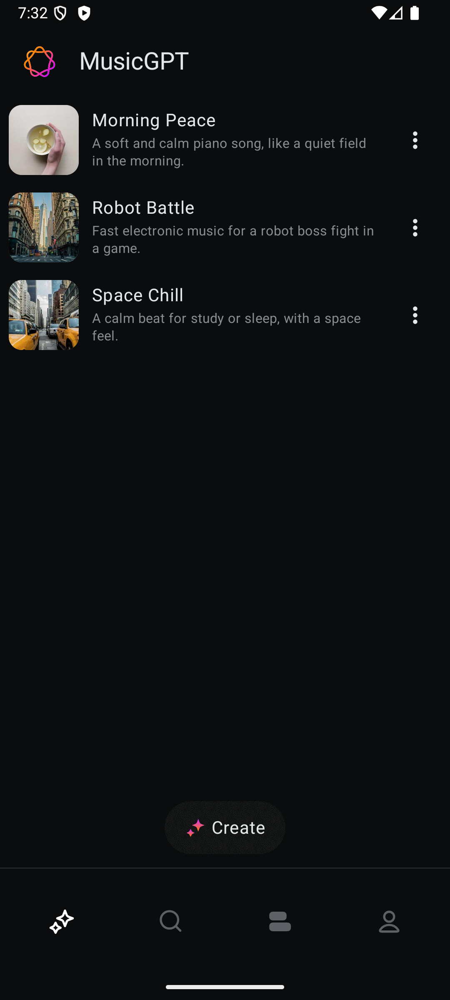
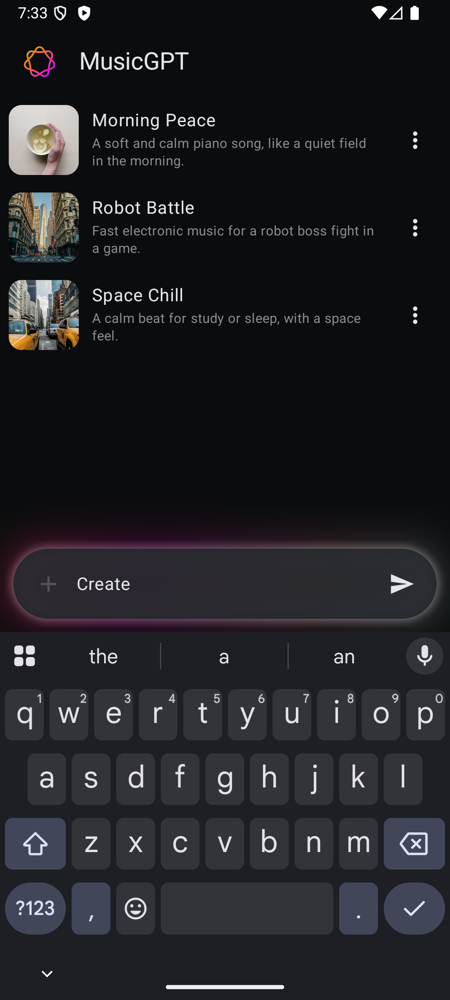
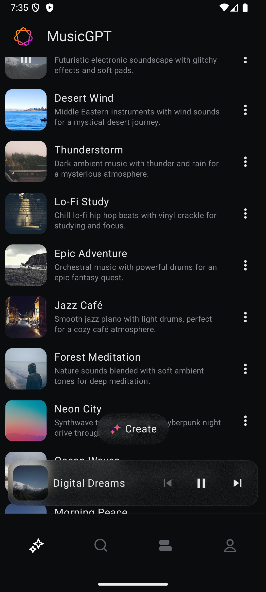

# MusicPlayer - Android Architecture Overview (Dummy Vibration Generation)

## 🎵 Project Overview

MusicPlayer is a modern Android application built with **Jetpack Compose** that focuses on AI-powered music generation and playback capabilities. Currently implements dummy vibration generation as a placeholder for future music generation features. The app follows **Clean Architecture** principles with a feature-based modular structure.

## 📱 Screenshots

| Main Screen | Music Creation | Music List                                      |
|-------------|----------------|-------------------------------------------------|
|  |  |  |

| Floating Player |
|-----------------|
|  |

*Screenshots showcase the 4-phase animated progress borders, glowing text input, 12 diverse dummy music items, and overall dark theme design*

## 🏗️ Architecture Pattern

### Clean Architecture + Feature-Based Modularization

The project implements a **multi-layered architecture** organized by features rather than technical layers:

```
app/src/main/java/com/example/musicplayer/
├── app/                    # Application layer
├── feature/                # Feature modules
│   ├── generate_music/     # AI Music Generation Feature
│   └── music_player/       # Music Playback Feature
├── navigation/             # App Navigation
├── ui/                     # Global UI Theme
├── ui_core/               # Reusable UI Components
├── utils/                 # Shared Utilities
└── main/                  # Main Activity & App Content
```

## 🔧 Technology Stack

### Core Technologies
- **Language**: Kotlin 100%
- **UI Framework**: Jetpack Compose
- **Architecture**: Clean Architecture + MVVM
- **Dependency Injection**: Hilt (Dagger)
- **Minimum SDK**: 26 (Android 8.0)
- **Target SDK**: 36

### Key Dependencies
- **Jetpack Compose** - UI toolkit
- **Hilt** - Dependency injection
- **Coil** - Image loading
- **Haze** - Blur effects
- **Material 3** - Design system

### Adding New Features:
1. Create feature package under `feature/`
2. Implement data layer (models, repositories, data sources)
3. Create UI components and screens
4. Add navigation integration
5. Set up dependency injection

### UI Component Development:
1. Create components in appropriate `ui_core/` or feature-specific directories
2. Use theme system for consistent styling
3. Implement preview functions for development
4. Add custom modifiers for reusability

---

This architecture provides a solid foundation for a modern Android music application with AI capabilities, emphasizing maintainability, testability, and user experience through advanced Compose UI techniques.